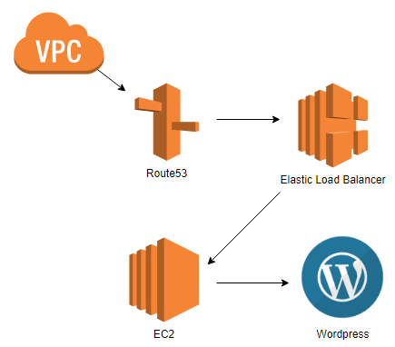
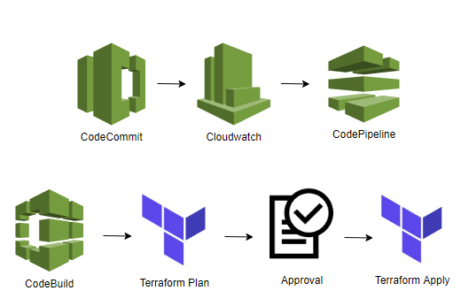
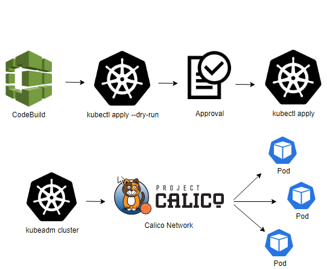
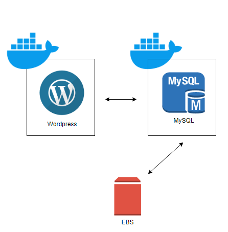
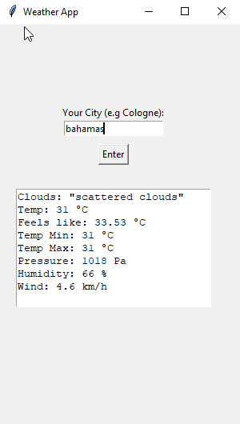
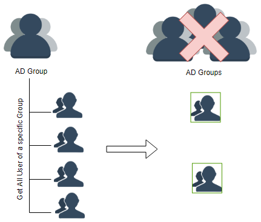
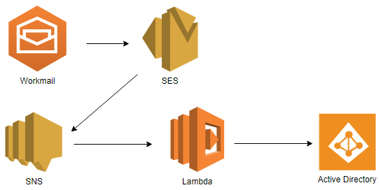
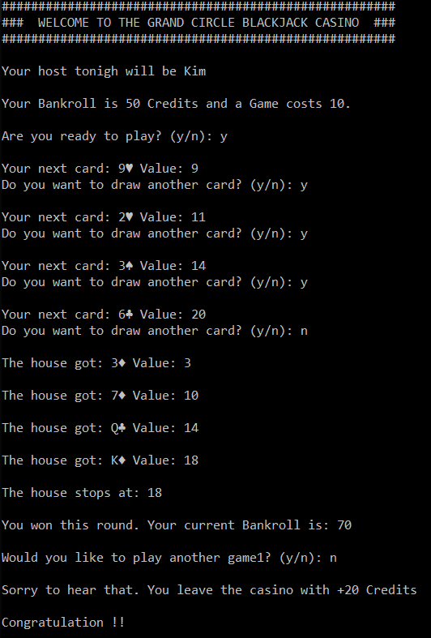
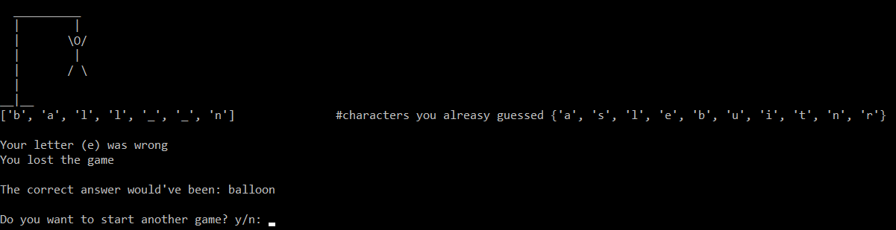
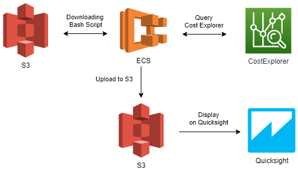

## **Welcome to my GitHub Website**

Since quite a while I'm interested in Cloud Engineering and especially the DevOps / Automatisation part of it. Working with AWS, Terraform, Python, Docker and Kubernetes is a thrilling adventure and there's so much to learn and work on. The purpose of this website is to show my journey going through all these tools and technologies and display the projects and code I've made.

[**Link to Github**](https://github.com/ThomasTusche?tab=repositories) | [**XING Profile**](https://www.xing.com/profile/Thomas_Tusche4/cv)

### **Project: Creating an environment with AWS, Terraform, Docker and Kubernetes for a wordpress website**

The first project I want to share with you is an entire infrastructure I created to host a wordpress website on. 
Nearly all AWS ressources were created with Terraform and deployed via CodePipeline. The Docker container is running
inside a Kubernetes Cluster, which is deployed through a Pipeline aswell.

#### AWS

To create the EC2 machines, on which Kubernetes runs, I created a VPC with public and private subnets. By visiting the URL of my website, the traffic will be hitting
the AWS Route53 service which automatically redirects the traffic to the Elastic Loadbalancer. The AWS ELB is listening for Http and Https traffic and 
routes the packages to the Kubernetes Node on which the Wordpress Service is running. This service is passing the traffic forward to the right container.

#### Terraform 

All my Terraform Code is placed inside an AWS CodeCommit Repository. Cloudwatch is monitoring the master branch and runs the
AWS CodePipeline everytime there is new code pushed to master. 
My pipeline consists of four steps:
- Recognising changes in the code
- Running a "terraform plan" against the current infrastructure and display any upcoming changes
- Waiting for a manual approval or rejection
- After code approval, runs the terraform apply

The Terraform code is available here:
[Terraform Repo](https://github.com/ThomasTusche/portfolio-website/tree/master/terraform)

#### Kubernetes 

I installed a Kubernetes cluster by using kubeadm and used Calico to deploy the network for the Pods.
After the Cluster was created I stored the Yaml files for my deployments inside a CodeCommit Repo which is watched by Cloudwatch.
Any changes to master will be recognised by Cloudwatch which triggeres a CodePipeline and runs the following steps:
- Recognising the code changes
- Running a kubectl apply --dry-run
- Waiting for approval or rejection
- Running a kubectl apply and deploying the changes

The Kubernetes code is available here:
[Kubernetes Repo](https://github.com/ThomasTusche/portfolio-website/tree/master/kubernetes)

#### Docker 

I created two container, one running Wordpress and the other one running the MySQL Server. Both are storing their files on the EBS
volume of the worker node, to keep the data even if pods are getting destroyed or restartet. Normally, I would store the data on an EFS Share
but here I went for the most simple solution.

### **Python Projects**

Python is incredible powerful while being relatively easy to write. Atleast for me, it is the first programming language I could really stick to, being not
a developer. Here are some projects and code example I did recently.

#### 1) Weather App

For this project I created a simple GUI with the Python Module *tkinter* and used a *http.client* to query the rapidapi.com "open-weather-map" API. To use this code you only have to enter your own API Key and you are good to go.

The Python code is available here:
[Weather App Code](https://github.com/ThomasTusche/weather_app)

#### 2) List User of a specific group and keep only those, who are not member of certain other groups

Sometimes you have an Active Directory Group giving basic access to some tool. Additionally, there are groups based on different departments, which extends those permissions. It can happen, that people end up getting the basic access but never made it into one of those department groups, therefore can enter a tool but not using it. 
This script however can scan a specific group, list all its users and check wether or not the user is in one of those department groups. It will crate two CSV file, one with the users without a department group and one where the "good" users are with their groups. Both lists include the Display Name, Username and Email address of the user and will be uploaded to S3 after the script is finished.

The Python code is available here:
[List AD User Code](https://github.com/ThomasTusche/get-ad-user)

#### 3) Add user to AD Group by sending an Email

I created a Lambda script and automatization to add user to an AD Group by sending an Email. For this you have to create a AWS workmail mailbox, connect it to SES which triggers a SNS Topic that fires the Lambda. It is a neat little thing which can be extended a lot more to make many manual tasks inside the AD more feasable.

The Python code is available here:
[Group to User by Email Code](https://github.com/ThomasTusche/user-to-group)

#### 4) Blackjack

The first game I tried was the casino game Blackjack. The dealer gives you a card after card until you stop or reach over 21. Afterwards the "Casino"
draws it's cards and, as the rules states, stops after hitting 17 or more points. The next step is to evaluate the points of the player against the
casino and decide who won. 
To make it a bit more interesting you start with a certain amount of credits and have to leave if you run out of them.

The Python code is available here:
[Blackjack Code](https://github.com/ThomasTusche/blackjack)

#### 5) Hangman

My second game was the Game Hangman. The project comes with a wordlist from which a random word is being chosen. The player gets to know the amount
of letters the word has and loses the games if his guesses failes 6 times. All guessed letters will be displayed, that you not chose the same letter twice,
and all correct letters will be additionally displayed at the spot they're appearing in the word. During your guesses, the Hangman figure will be painted
and for each wrong answer a new body part will be added to the stickman.

### **Project: AWS Cost Allocator Shell Script inside a Docker Container (AWS CLI & Shell)**

Costs are an important factor for any infrastructure whether being hosted inside a public cloud or not. At one point I had to gather specific costs
of three different AWS Accounts and restructure the Data that they could be displayed inside AWS Quicksight. Additionally, I wanted to run it inside a
docker container on a sheduled basis. The container gets triggered by a Cloudwatch Rule, downloads the configuration and scripts, excecutes them 
and upload the generated file on an S3 Bucket. 

The Shell Script and Dockerfile is available here:
[Costallocator_Projekt](https://github.com/ThomasTusche/awscli_cost_allocator)

